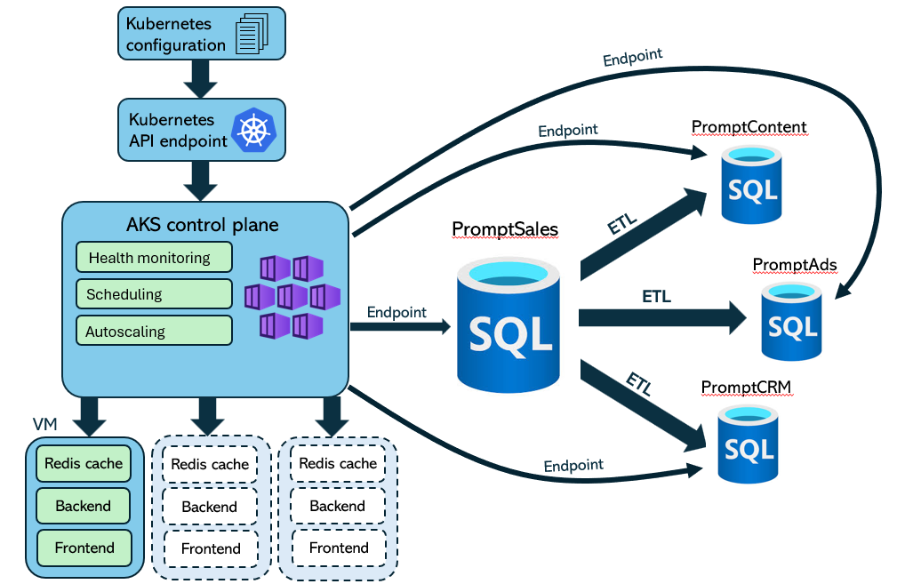

# Caso-2-PromptSales
### Instituto Tecnológico de Costa Rica
### Escuela de Ingeniería en Computación
### Students
- Alexander Brenes Garita - 2018191805
- Andrés Baldi Mora - 2024088934
- Lindsay Nahome Marín Sánchez - 2024163904
### Course
Software Design
### Delivery dates
🗓️ First delivery: October 26, 2025

🗓️ Second delivery: November 8, 2025

🗓️ Final delivery: November 23, 2025


### Project Structure:

```bash
Caso-2-PromptSales/
├── diagrams/
├── img/
├── kubernetConfig/
└── README.md
```

## 1. Introduction
This repository details the design of the application Prompt Sales

## 2. Scope
This project will be executed through three iterations.

## 3. Metrics for non-functional requirements

### 3.1 Performance

### 3.2 Scalability
To transform PromptSales into a highly scalable system, we will use Azure Kubernetes Service (AKS). Additionally, Azure SQL Database will assure horizontal scaling capabilities in all the databases.

The Kubernetes network, managed by AKS, is responsible for dynamically scaling the stateless application pods and the Redis cache. 

The Redis cache is configured for automatic scaling using a Horizontal Pod Autoscaler (HPA) with a range of X to Y replicas. According to the established amount in the performance section.

Here is the HPA file that demonstrates scalability with the cache:
```yaml
apiVersion: autoscaling/v2
kind: HorizontalPodAutoscaler
metadata:
  name: redis-hpa
  namespace: redis-cache
spec:
  scaleTargetRef:				# This file targets the deployment of redis.
    apiVersion: apps/v1
    kind: Deployment
    name: redis-deployment
  minReplicas: 2
  maxReplicas: 10
  metrics:
    - type: Resource
      resource:
        name: cpu
        target:
          type: Utilization
          averageUtilization: 70		# The autoscale will take place when more than 70% of a pod's cpu is being used
    - type: Resource
      resource:
        name: memory
        target:
          type: Utilization
          averageUtilization: 75		# The autoscale will take place when more than 75% of a pod's memory is being used
```
It declares a minimum of X replicas and maximum of Y. The scale takes place when more than 70% of CPU is being consumed in one pod or 75% of memory is being used instead.

All scaling rules and pod configurations are defined and managed through declarative YAML files.

[Check kubernetes configuration folder]( https://github.com/CholiRat/Caso-2-PromptSales/tree/main/kubernetConfig)

For the databases, scalability is managed directly by Azure SQL Database. This plataform offering provides robust horizontal scaling through two primary mechanisms:

-	Elastic Pools: To efficiently manage performance and cost for multiple databases with variable usage patterns.
-	Sharding with Elastic Database Tools: To distribute data across multiple databases to handle high-volume transactions.

For more information check the oficial documentation: [Elastic scale - Azure SQL Database | Microsoft Learn](https://learn.microsoft.com/es-es/azure/azure-sql/database/elastic-scale-introduction?view=azuresql)

To meet the requirement of handling 100,000 transactions, the data will be partitioned across X sharded set of databases. This is according to the data retrieved from the perfomance benchmarks
-	Number of Shards: The system will be configured with X shards. 
-	Data Distribution: Information will be partitioned into X distinct parts using a hash function over the campaignIDs. In this way, distribution is balanced according to the amount of campaigns in the system.

To give a better understanding of the architecture, a diagram is provided:


### 3.3 Reliability

### 3.4 Availability

#### Load balancers


#### Failover and replication

#### Service Level Agreement (SLA)
Azure guarantees 99.95% availability for their SQL Database services, which forms the foundation of our high-availability architecture.
Assuming a 31 day month, this means:
•	Total minutes in month: 44,640 min
•	Available minutes per Azure SLA: 44,617.68 min
•	Azure SLA downtime allowance: 22.32 min
#### Failover considerations
According to Azure documentation, databases are down for up to 25 seconds while the regions are being switched. For this calculation, we assume the worst scenario, 25 seconds of downtime.
- Assumed fail frequency: 2 times per day through all Prompt Sales services
- Daily downtime: 50 seconds (2 × 25 seconds)
- Monthly downtime (31 days): 1,550 seconds (25.833 minutes)
- Azure infrastructure: 22.32 min
- Planned failovers: 25.833 min
- Total downtime: 48.153 min
- Available total minutes: 44,591.847 min

Monthly availability: 99.892%
The system achieves 99.89% availability, comfortably meeting the standards for this requirement.


### 3.5 Security

### 3.6 Maintainability

### 3.7 Interoperability
To ensure the different PromptSales modules (Ads, Content, and CRM) work in an integrated manner and can connect with external services, we have decided to use REST APIs as our primary communication method.

We will use this approach for all communication between the services and for managing automation processes. When designing our APIs, we will follow RESTful principles, such as using cache to optimize interactions and make the platform faster.

Finally, for the specialized communication between the various AI services, which have different requirements, we are reserving the use of MCP servers (Message Oriented Middleware Communication Protocols).
### 3.8 Compliance

### 3.9 Extensibility

## 4. Domain Driven Design

#### 4.1 Prompt Content Domains
Prompt content focuses on requests to AI services to produce ad material such as text, images and videos. As such, the following list illustrates the domains that compose this business.
- User domain
- AI domain
- Target domain
- Prompt domain
- Generated content domain
- Channel domain
#### 4.2 Prompt Ads Domains
Prompt ads manages the creation of new marketing campaigns.
- User domain
- AI domain
- Organization domain
- Campaign domain
- Ad domain
- Target domain
- Reaction domain
- Channel domain
- Client domain
- Payment domain
#### 4.3 Prompt CRM Domains
Prompt CRM has the goal to follow activity of interested customers.
- User domain
- AI domain
- Target domain
- Channel domain
- Client domain
- Marketing services domain
- Payment domain


