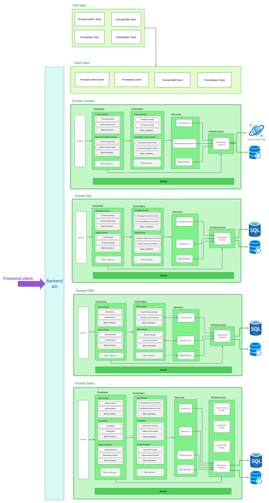
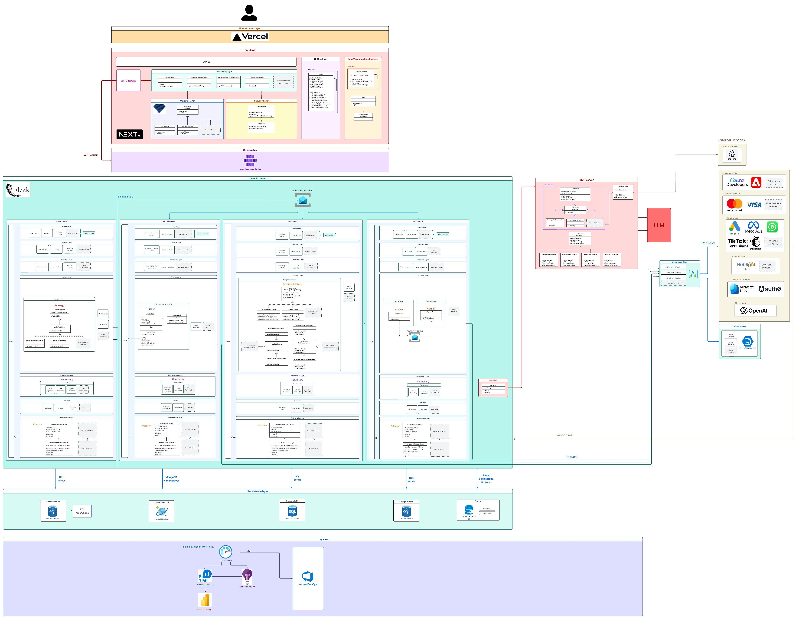
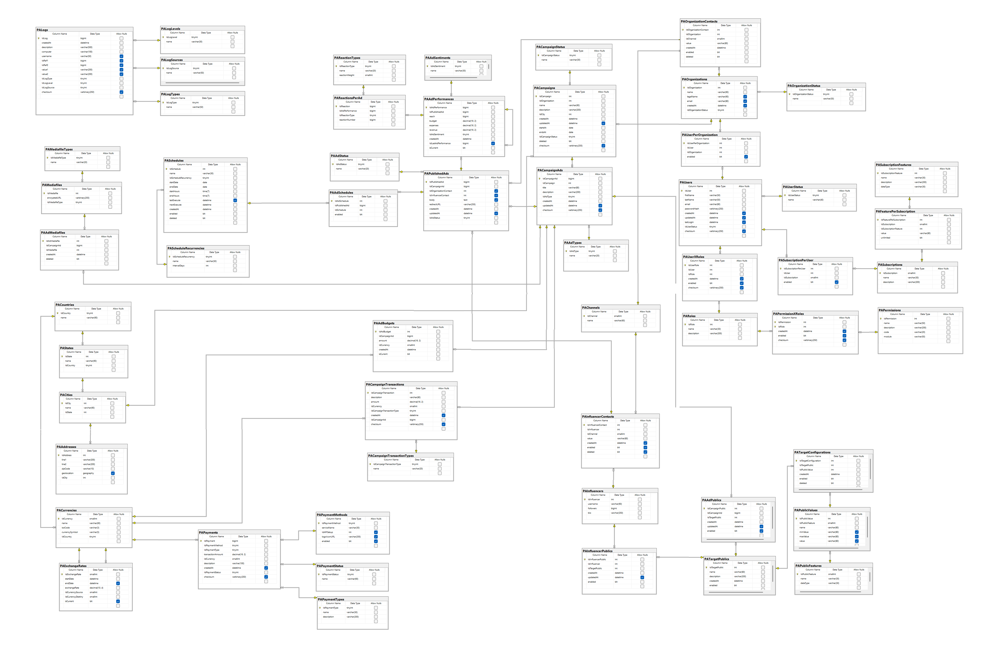
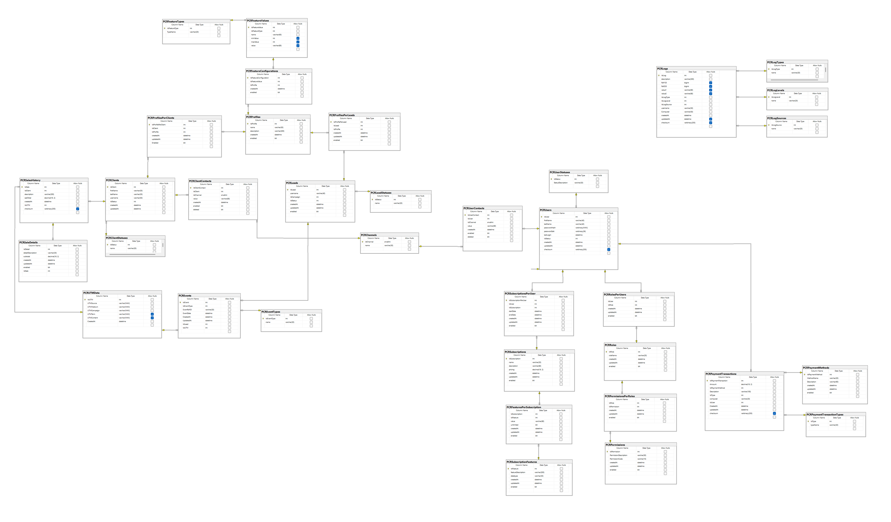
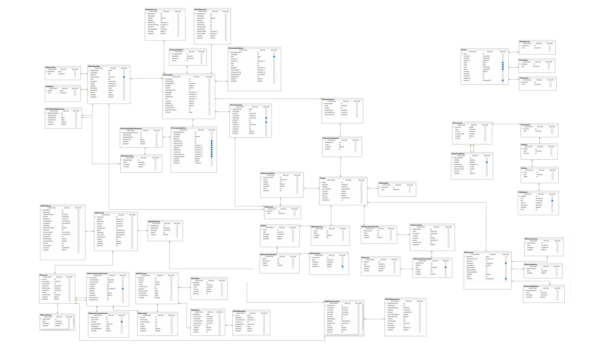
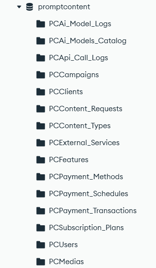
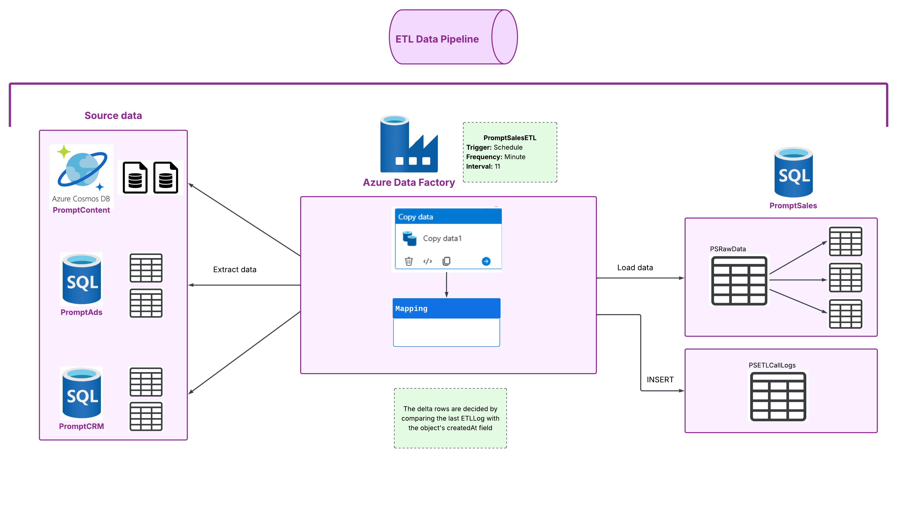

# PromptSales Software Design

### Members
- Alexander Brenes Garita - 2018191805
- Andrés Baldi Mora - 2024088934
- Lindsay Nahome Marín Sánchez - 2024163904
- Javier Rodríguez Menjívar - 2023074732

### Project Structure:

```bash
Caso-2-PromptSales/
├── documents/
│   ├── diagrams/
│   └── img/
├── src/
│   ├── common/
│   │   ├── dto/
│   │   ├── exceptions/
│   │   ├── logging/
│   │   ├── middleware/
│   │   └── utils/
│   ├── config/
│   ├── database/
│   │   ├── nosql/
│   │   │   ├── examples/
│   │   │   └── schemas/
│   │   ├── orm/
│   │   │   ├── models/
│   │   │   └── sessions/
│   │   ├── pipeline/
│   │   │   ├── etl/
│   │   │   └── jobs/
│   │   ├── sql/
│   │   │   ├── migrations/
│   │   │   ├── schemas/
│   │   │   └── stored-procedures/
│   ├── deploy/
│   │   ├── ci-cd/
│   │   ├── kubernetConfig/
│   │   │   ├── prompt-ads/
│   │   │   ├── prompt-content/
│   │   │   ├── prompt-crm/
│   │   │   └── prompt-sales/
│   │   └── scripts/
│   ├── Domain/
│   │   ├── PromptAds/
│   │   │   ├── Contracts/
│   │   │   │   ├── CampaignContracts/
│   │   │   │   └── TargetContracts/
│   │   │   ├── Controllers/
│   │   │   │   ├── CampaignControllers/
│   │   │   │   └── TargetControllers/
│   │   │   ├── Infrastructure/
│   │   │   │   └── Repositories/
│   │   │   └── Services/
│   │   │       ├── CampaignServices/
│   │   │       └── TargetServices/
│   │   ├── PromptContent/
│   │   │   ├── Contracts/
│   │   │   │   ├── GeneratedContentContracts/
│   │   │   │   └── PromptContracts/
│   │   │   ├── Controllers/
│   │   │   │   ├── GeneratedContentControllers/
│   │   │   │   └── PromptControllers/
│   │   │   ├── Infrastructure/
│   │   │   │   └── Repositories/
│   │   │   └── Services/
│   │   │       ├── GeneratedContentServices/
│   │   │       └── PromptServices/
│   │   ├── PromptCRM/
│   │   │   ├── Contracts/
│   │   │   │   ├── ClientContracts/
│   │   │   │   └── SalesContracts/
│   │   │   ├── Controllers/
│   │   │   │   ├── ClientControllers/
│   │   │   │   └── SalesControllers/
│   │   │   ├── Infrastructure/
│   │   │   │   └── Repositories/
│   │   │   └── Services/
│   │   │       ├── ClientServices/
│   │   │       └── SalesServices/
│   │   └── PromptSales/
│   │       ├── Contracts/
│   │       │   ├── AdContracts/
│   │       │   ├── PaymentContracts/
│   │       │   └── UserContracts/
│   │       ├── Controllers/
│   │       │   ├── AdControllers/
│   │       │   ├── PaymentControllers/
│   │       │   └── UserControllers/
│   │       ├── Infrastructure/
│   │       │   └── Repositories/
│   │       └── Services/
│   │           ├── AdServices/
│   │           ├── PaymentServices/
│   │           └── UserServices/
│   ├── gateway/
│   ├── mcpServer/
│   │   └── integrations/
│   ├── security/
│   └── test/
│       ├── api/
│       ├── integration/
│       ├── mcp/
│       ├── security/
│       ├── stress/
│       └── unit/
└── README.md
```

## 1. Introduction
PromptSales is a modular ecosystem composed of three interconnected sub-platforms, each specializing in a distinct phase of the marketing and sales lifecycle.
- **PromptContent**: For dynamic content generation.
- **PromptAds**: For targeted advertising campaigns.
- **PromptCRM**: For customer relationship management and segmentation.

PromptSales is built with RESTful architecture, deployed in a cloud-native environment using Microsoft Azure. To ensure scalability, and availability, all services are containerized and orchestrated via Kubernetes. Communication between services is governed by MCP servers, which facilitate the integration of AI in workflows.

This repository is organized to guide developers and architects through the full lifecycle of PromptSales system design. Use this repository as a reference for building, deploying, and extending the PromptSales ecosystem.

## 2. Scope
This project will be executed through three iterations.
#### First iteration:
- Details of non functional requirements
- Benchmarks and strategies implemented to achieve specific metrics
- Domain driven design
#### Second iteration:
- Architecture design
- Project structure with separation between modules
- Code examples and service configurations

## 3. Metrics for non-functional requirements

## 3.1 Performance

This section estimates the system performance for its **main operation: processing a sales campaign request**.

We used the [FastAPI (Python) benchmark](https://sharkbench.dev/web/python-fastapi) as reference, which reports **1185 RPS (requests per second)** on a **Ryzen 7 7800X3D CPU** with **21 ms latency**.  
Our main operation involves approximately **three internal sub-calls**, so the effective throughput per base instance is:

$$
RPS_{effective} = \frac{1185}{3} \approx 395\ RPS
$$

### Hardware adjustment

The project will be deployed on **Azure App Service – Premium v3**, tier **P2v3 (4 vCPUs, 16 GB RAM)**, which provides roughly **2× the compute capacity** of the benchmark environment.

Therefore, the estimated throughput per instance is:

$$
RPS_{instance} \approx 395 × 2 = 800\ RPS
$$

### Calculation for 100,000 transactions per minute

According to the project requirement, the system must process **100,000 transactions per minute**, which is equivalent to:

$$
RPS_{required} = \frac{100,000}{60} \approx 1,667\ RPS
$$

The number of FastAPI instances required is:

$$
Instances = \left\lceil \frac{RPS_{required}}{RPS_{instance}} \right\rceil = \left\lceil \frac{1,667}{800} \right\rceil = 3\ instances
$$

### Final configuration

| Component | Type / SKU | Estimated Throughput | Required Instances | Justification |
|------------|-------------|----------------------|--------------------|----------------|
| **FastAPI App** | Azure App Service – P2v3 (4 vCPUs, 16 GB RAM) | 800 RPS | 3 | Meets 100 k TPM with margin |
| **SQL Server** | 2 vCores | ≤ 400 TPS | 1 | Complementary, not a bottleneck |
| **Cache (optional)** | Redis Basic | — | 1 | Used for sessions/logs only |

**Conclusion:**  
With **three App Service P2v3 instances**, the system can handle approximately **100 000 transactions per minute (~1 667 RPS)** while maintaining an average response time below **2.5 seconds per operation**, satisfying the project’s performance requirement.

**Reference sources:**  
- FastAPI Benchmark – *SharkBench* (1185 RPS, Ryzen 7 7800X3D)  
- [Microsoft Docs – App Service Premium v3 Specifications](https://learn.microsoft.com/en-us/azure/app-service/app-service-plan-manage)


### 3.2 Scalability
To transform PromptSales into a highly scalable system, **Azure Kubernetes Service (AKS)** will be used. 

To assure horizontal scaling capabilities in all the databases, **Azure SQL Database** will be used.

In the case of mongoDB, **Azure Cosmos DB** will be used to create regional replicas and scale the PromptContent database. 

The Kubernetes network, managed by AKS, is responsible for dynamically scaling the stateless application pods.

Based on the benchmark results in section 3.1, the databases require a **minimum of 3 pods** to handle the expected load. To meet this requirement, the deployments use a Horizontal Pod Autoscaler (HPA) that dynamically adjusts the number of replicas up to 30, providing up to 10x capacity as demand increases.

Here is the HPA file that demonstrates scalability:

```yaml
# NAMESPACE: promptads-app
# This HorizontalPodAutoscaler (HPA) file fulfills the goal of scalability in the system.

apiVersion: autoscaling/v2
kind: HorizontalPodAutoscaler
metadata:
  name: promptads-hpa
  namespace: promptads-app
spec:
  scaleTargetRef:				# This file targets the deployment of promptads.
    apiVersion: apps/v1
    kind: Deployment
    name: promptads-deployment
  minReplicas: 3
  maxReplicas: 30				# x10 the scale
  metrics:
    - type: Resource
      resource:
        name: cpu
        target:
          type: Utilization
          averageUtilization: 80		# The autoscale will take place when more than 80% of a pod's cpu is being used
    - type: Resource
      resource:
        name: memory
        target:
          type: Utilization
          averageUtilization: 85		# The autoscale will take place when more than 85% of a pod's memory is being used

```
It declares a minimum of 3 replicas and maximum of 30. 

The scale takes place when more than 80% of CPU is being consumed in one pod or 85% of memory is being used instead. These are high values that assure better balancing through the pods.

All scaling rules and pod configurations are defined and managed through declarative YAML files.

[Check kubernetes configuration folder](src/deploy/kubernetConfig)

For the SQL databases, scalability is managed directly by Azure SQL Database. This plataform offering provides robust horizontal scaling through two primary mechanisms:

-	**Elastic Pools**: To efficiently manage performance and cost for multiple databases with variable usage patterns.
-	**Sharding with Elastic Database Tools**: To distribute data across multiple databases to handle high-volume transactions.

For more information check the oficial documentation: [Elastic scale - Azure SQL Database | Microsoft Learn](https://learn.microsoft.com/es-es/azure/azure-sql/database/elastic-scale-introduction?view=azuresql)

To meet the requirement of handling 100,000 transactions, the data will be partitioned across 3 sharded set of databases. This is according to the data retrieved from the performance benchmarks
-	**Number of Shards**: The system will be configured with 3 shards.
-	**Data Distribution**: Information will be partitioned into 3 distinct parts using a hash function over the campaignIDs. In this way, distribution is balanced according to the amount of campaigns in the system.

### 3.3 Reliability

The project must guarantee continuous service availability and automatic fault detection.  
The **error rate** must not exceed **0.1% of total daily transactions**.

**Example:**  
If 100,000 transactions are processed per day, the maximum allowed failures are **≤ 100**.

**Azure Monitor Alerts** will be used to detect and notify critical failures.

The configured alert thresholds are as follows:

- **Deadlocks > 3 / 10 min →** SQL Server alert  
- **Redis Hit Rate < 85% →** preventive alert  
- **Pod restarts > 3 / hour →** instability alert  

If issues persist for more than **10 minutes**, a ticket will automatically be created in **Azure DevOps**.  

All detailed diagnostic information will be stored in **Azure Log Analytics Workspace**.

### 3.4 Availability

To ensure system resilience, high availability is implemented across both the databases and application using a combination of Azure SQL database, Azure Cosmos DB and AKS.

For the data layer, high availability is achieved using the **Geo-Replication** feature of Azure SQL Database (PaaS). This service is configured for every database shard (PromptSales, PromptAds, PromptCRM) and provides two critical functions:
- **Real-time Replication:** A constant, synchronized replica of each primary database is maintained in a secondary geographic region (West Europe) which is constantly being synced with the primary region. This ensures data is duplicated in near real-time, protecting against High availability disaster recovery.
- **Automatic Failover:** In the event of an outage in the primary region (US), Azure automatically redirects all connections to the secondary database without manual intervention. This failover process takes less than 25 seconds, guaranteeing high availability. Once the primary region is restored, connections are moved back.

In the case of the documental database PromptContent, Azure Cosmos DB includes:
- **Real-time Global Replication:** A synchronized replica of the database is automatically maintained in all configured Azure regions.
- **Automatic Failover:** In the event of an outage in one region, Azure Cosmos DB automatically redirects all connections to the next available region without manual intervention.

The connection endpoints for these configurations are managed within the cluster via a ConfigMap:
```yaml
apiVersion: v1
kind: ConfigMap
metadata:
  name: azure-config
  namespace: default
data:
  # Primary regions
  AZURE_PRIMARY_REGION: "US"
  PROMPTSALES_DB_PRIMARY: "promptsales-db-us.database.windows.net"
  PROMPTADS_DB_PRIMARY: "promptads-db-us.database.windows.net"
  PROMPTCONTENT_DB_PRIMARY: "promptcontent-db-us.database.windows.net"
  PROMPTCRM_DB_PRIMARY: "promptcrm-db-us.database.windows.net"
  
  # Secondary regions
  AZURE_SECONDARY_REGION: "West Europe" 
  PROMPTSALES_DB_SECONDARY: "promptsales-db-westeurope.database.windows.net"
  PROMPTADS_DB_SECONDARY: "promptads-db-westeurope.database.windows.net"
  PROMPTCONTENT_DB_SECONDARY: "promptcontent-db-westeurope.database.windows.net"
  PROMPTCRM_DB_SECONDARY: "promptcrm-db-westeurope.database.windows.net"
```
Check the [azure configuration for sql databases](src/deploy/kubernetConfig/azure-config.yaml)

For more information about Geo-replication, visit: [Active-Geo-replication](https://learn.microsoft.com/en-us/azure/azure-sql/database/active-geo-replication-configure-portal?view=azuresql&tabs=portal)

For information about replication in Azure Cosmos DB visit: [Distribute your data globally with Azure Cosmos DB](https://learn.microsoft.com/en-us/azure/cosmos-db/distribute-data-globally)

---

On another note, AKS will assure replication and failover using K8s a LoadBalancer and HPA.

Kubernetes automatically maintains the desired number of application pod replicas as defined in the Horizontal Pod Autoscaler (HPA). If a pod fails, AKS immediately restarts it or schedules a new one.

This is a section of the HPA file for the promptads backend
```yaml
  scaleTargetRef:				# This file targets the deployment of promptads.
    apiVersion: apps/v1
    kind: Deployment
    name: promptads-deployment
  minReplicas: 3
  maxReplicas: 30	
```
Check the [HPA.yaml](src/deploy/kubernetConfig/prompt-ads/deployment.yaml) file for promptads.

With the LoadBalancer type service, the application efficiently distributes incoming network requests across all available, healthy application pods.
```yaml
# NAMESPACE: promptsales-app
# The service file establishes the point of connection for promptsales in our kubernet

apiVersion: v1
kind: Service
metadata:
  name: promptsales-service
  namespace: promptsales-app
spec:
  type: LoadBalancer		# Balances the requests between different replicas
  selector:
    app: promptsales-app
  ports:
    - protocol: TCP
      port: 80                    
      targetPort: 8080      
```

Check the [service.yaml](src/deploy/kubernetConfig/prompt-sales/service.yaml) file for promptsales.

#### Downtimes
Total minutes in a month: 44 640 min

| Service                | SLA       | Downtime per Month |
|------------------------|-----------|---------------------|
| Azure SQL Database     | 99.995%   | 2.232 min           |
| Azure Cosmos DB        | 99.99%    | 4.464 min           |
| Azure Cache for Redis  | 99.9%     | 44.64 min           |
| Azure Kubernetes Service (AKS) | 99.9%     | 44.64 min           |

Total potential downtime by Azure Services: 44.64 + 44.64 + 4.464 + 2.232 = 95.976 min
Total potential Azure availability: 44544.024 min or 99.785%

PromptSales mitigates the effects of Azure downtime with these two strategies: 
- Our 3-30 replicas guarantee that at least one pod is active at any given time, this uptime is approximately 100%. 
- If Redis fails, the app will redirect the requests to the databases, meaning there should not be downtime provoked by the cache being unavailable. 

The remaining time is 2.232 +  4.464 = 6.696 minutes where PromptSales modules will be down disregarding Azure failures.
Total PromptSales availability: 44,640 - 6.696 = 44,633.304 min

This means that while the Azure platform collectively experiences 95.976 minutes of potential downtime across all services, **PromptSales only contributes 6.696 minutes of that downtime**.

The system achieves **99.985% monthly availability**, comfortably meeting the standards for this requirement.

Consulted links:
- [Azure SQL Database SLA](https://learn.microsoft.com/en-us/azure/azure-sql/database/business-continuity-high-availability-disaster-recover-hadr-overview?view=azuresql)
- [Azure Cosmos DB SLA](https://www.azure.cn/en-us/support/sla/cosmos-db)
- [Azure Cache for Redis SLA](https://www.azure.cn/en-us/support/sla/cache)
- [AKS SLA]( https://www-azure-cn.translate.goog/en-us/support/sla/kubernetes-service/?_x_tr_sl=en&_x_tr_tl=es&_x_tr_hl=es&_x_tr_pto=tc)


### 3.5 Security

Confidentiality, integrity, and availability of user and transaction data in the PromptSales system must be guaranteed.  
The following technologies will be used to ensure security:

#### Authentication and Authorization

**OAuth 2.0 + OpenID Connect** will be used for the API Gateway component, with access control managed through signed **JWT tokens**.

#### Data Protection

To protect data in our SQL Server database, **Transparent Data Encryption (TDE) with AES-256** will be used, with master keys distributed and secured using **Azure Key Vault**.

#### Controls

- To protect our API, **Azure API Management** will be used to limit requests per IP and validate tokens.  
- To protect against attacks, **Azure Front Door WAF** will be used with **OWASP Core Rule Set v3.2** rules.  
- For traceability, **Azure Monitor + Sentinel SIEM** will be used for log correlation, anomaly detection, and threat analysis.

### 3.6 Maintainability
To ensure the maintainability of the system in both the short and long term, standardized processes will be implemented for both development and post-production support.

#### 3.6.1 During Development

Source code and task management will adhere to the following methodologies:

- Task Management: All work will be managed through a ticketing system in Trello. Each team member is responsible for keeping their tickets updated on a weekly basis.
- Version Control: A Gitflow-based workflow will be used, with the following branches:

    - Main Branch / Master
      - Contains stable production code of all project, including versions (release tag, eg: v1.2.3), production configuration (environment variables or config files) and documentation for releases that should be update or include somewhere else in the branch, like release notes or a CHANGELOG.md for example.
    
    - HotFixes Branch
      - Branches for critical fixes in production, based on main. This branch is used for fixing issues on the master branch. Is employed for quickly fix critical issues and for urgent bugs that can not wait until the next release cycle. For example, Security vulnerabilities.

    - Release Branch
      - Is used to stabilize the codebase before deploying to production. Allows to do things like this ones:
        - Freeze development for the current sprint/release cycle.
        - Perform final QA, bug fixing, and versioning.
        - Continue development of new features in parallel (in develop).
    
    - Develop Branch
      - Is the central integration branch for all new code that’s being prepared for the next release. Is where all the developers work on and all the features are merged once they are done. Is where the lastest stable development version of the software lives in.
    
    - Feature Branch
      - Is used to develop a single feature or improvement in isolation. Isolated from develop until the feature is complete. Focused on a specific goal or story. Temporary: deleted after being merged into develop.

      GitFlow Image

      

- Other things that are going to be employ for Maintainability during development are the following:


- Pull Requests (PRs): All code must be integrated into develop or main exclusively through Pull Requests. Each PR must be reviewed and approved by at least one team member before merging.

- Release Process: Production releases will be carried out on a scheduled basis every two weeks (sprint cycle), merging the develop branch into main after successful validation in the staging environment.

- Hotfix Process: Critical fixes (hotfixes) will be developed in their own branch (hotfix/) based on main. Once approved, they will be merged into both main (for immediate deployment) and develop (to prevent regressions).

#### 3.6.2 Post-Development Support

A tiered support model (L1, L2, L3) is established to manage incidents and inquiries:

- Level 1 (L1 – Basic Support):

  - Channel: User manuals, tutorial videos, and an RAG (Retrieval-Augmented Generation) system via WhatsApp for common questions.

  - Objective: Self-service and resolution of frequent doubts.

- Level 2 (L2 – Technical Support):

  - Channel: Email (support@promptsales.com).

  - Response Time (Service Level Agreement): Acknowledgment between 8 and 12 business hours.

  - Resolution Time (Service Level Agreement): Incident resolution between 4 and 7 business days.

- Level 3 (L3 – Specialized Support):

  - Channel: Internal issue tracking system (e.g., Trello or GitHub Issues), escalated from L2.

  - Objective: Resolution of complex bugs, infrastructure failures, or integration problems requiring development team intervention.

### 3.7 Interoperability
To ensure that the PromptSales modules (Ads, Content, and CRM) operate in an integrated manner and can connect with external services, we have chosen REST APIs as our primary communication method.

This approach will be used for all communication between services built with Flask and FastAPI, as well as for managing automation processes.
When designing our APIs, we will follow RESTful principles, including the use of Redis caching to optimize interactions and improve platform performance, in line with performance requirements.

Finally, for specialized communication among various AI services (which have different requirements), the use of MCP (Model Context Protocol) servers will be reserved.
### 3.8 Compliance

The system will be designed in accordance with international standards for security and data protection:

#### Payment Management

All credit card, transfer, or monetary transaction data will not be stored in our systems. These operations will be fully delegated to third-party payment gateways that comply with PCI DSS certification.

#### Application Security

- Web applications (Vercel) will follow the OWASP Top 10 2.0 recommendations.

- Backend services (REST APIs in Flask/FastAPI) will be developed mitigating OWASP Top 10 3.x vulnerabilities, with particular emphasis on access control (OAuth 2.0) and data injection.

#### Data Protection (GDPR/CCPA)

- Encryption of sensitive data at rest (AES-256) and in transit (TLS 1.3).
- Implementation of the least privilege principle (minimum necessary access).
- Mechanisms for user consent management and the right to be forgotten.

### 3.9 Extensibility
Design choices have been made to guarantee the extensibility of the system across its lifetime. In this section, design patterns and other tools are discussed to demonstrate their ability to expand the application.
#### 3.9.1 REST
The REST architecture employed across the entire system enables integration with new sub-businesses and third-party services. 

When a new business is incorporated into PromptSales, the frontend layer remains unaffected, allowing to add new services. Also, the stateless nature of REST architecture further enhances independence between the different architectural layers, ensuring clean separation and modularity.
#### 3.9.2 Kubernetes
Kubernetes provides foundation for system extensibility by allowing integration of new services and capabilities without disrupting existing operations. Its architecture is specifically designed to support continuous growth and modular expansion. AKS extends these capabilities with cloud-specific features that further simplify extensibility.
#### 3.9.3 MCP 
MCP servers centralize the connection point for various AI models. This architecture allows new sub-businesses to immediately leverage existing AI tools available to develop. Furthermore, the system is extensible at the MCP layer; new tools, context sources, or AI models can be added to the MCP server, thereby expanding its capabilities without requiring modifications across every other system component.
#### 3.9.4 Domain Driven Design
The Domain-Driven Design architecture for the backend is crucial for extensibility. It ensures that new functionalities are added as entirely new domains, rather than by modifying existing ones. This prevents regressions and maintains system stability. Consequently, development teams can work independently on different domains, accelerating feature development and enabling parallel workstreams without creating interdependencies or conflicts.

## 4. Domain Driven Design

#### 4.1 Prompt Content Domains
Prompt content focuses on requests to AI services to produce ad material such as text, images and videos. As such, the following list illustrates the domains that compose this business.
- User domain
- AI domain
- Target domain
- Prompt domain
- Generated content domain
- Channel domain
#### 4.2 Prompt Ads Domains
Prompt ads manages the creation of new marketing campaigns.
- User domain
- AI domain
- Organization domain
- Campaign domain
- Ad domain
- Target domain
- Reaction domain
- Channel domain
- Client domain
- Payment domain
#### 4.3 Prompt CRM Domains
Prompt CRM has the goal to follow activity of interested customers.
- User domain
- AI domain
- Target domain
- Channel domain
- Client domain
- Sales domain
- Marketing services domain
- Payment domain
#### 4.4 Prompt Sales Domains
- User domain
- AI domain
- Organization domain
- Campaign domain
- Ad domain
- Target domain
- Channel domain
- Client domain
- Payment domain
- Services domain


## 5. Technologies Control Version 

To ensure that the versions of the technologies used in production and development are correct, the following technologies and their corresponding versions must be used in the software. This is intended to prevent issues during both development and production stages.

Dependency versions will be strictly controlled via pinned version files (e.g., `requirements.txt` for Python, `package-lock.json` for Node.js) and immutable Docker image tags (avoiding 'latest' in production) to ensure consistency across environments.

### 5.1 Frontend Runtime Environment (Vercel): Node.js v20 (LTS) with Next.js v14.2.x

### 5.2 Microservices in Azure Kubernetes Services (Backend) and Infrastructure

| Technology       | Version / Specification | Justification |
|------------------------|-----------|---------------------|
| **Python**   | `v3.12.x`  | High end performance version of python and can access most of python libraries |
| **FastAPI**  | `v0.110.x` | High end framework for REST Microservices           |
| **Pydantic** | `v2.7.x`   | High speed data validators           |
| **Redis-py** | `v5.0.x.`  | Distributed cache with high availability           |
| **Kubernetes** | `v1.29`  | Supported stable version by AKS | 
| **Uvicorn** | `v0.29.x`   | ASGI Server for executing FastAPI apps on production | 
| **Docker** | `v26.x`   | Standard OCI container engine for building images | 


### 5.3 Data Persistence

| Technology       | Version / Specification | Justification |
|------------------------|-----------|---------------------|
| **Azure SQL Database** | `2022 SQL Server`  | Principal relational database  |
| **Azure Cosmos DB for MongoDB (Cosmos DB)**  |API Mongo `v6.0` | NoSQL for PromptContent and massive logs |
| **Azure Cache for Redis (Redis)** | `v6.0`| Basic, Standard or Premium tier, does not support upgrades to newer Redis version|
| **SQLAlchemy** | `v2.0.x` | Modern ORM for relational databases with Asynchronous support|
| **aioodbc** | `v0.3.x` | Asynchronous driver for connecting FastAPI with Azure SQL Server |

### 5.4 MCP Service and AI SDKs

| Technology       | Version / Specification | Justification |
|------------------------|-----------|---------------------|
| **Model Context Protocol (MCP) Draft**   | `v1.0`  | N/A |
| **OpenAI Python SDK**  | `v1.x` | N/A |
| **PyJWT**  | `v2.8.x` | Required for validating JWT tokens (OAuth 2.0 security) |


#### Diagram
The following is an image of the Domain Driven Design backend. The frontend communicates through an API and has access to all sub-businesses. 

The main application PromptSales gains access to Prompt Content, Prompt Ads and Prompt CRM through the infrastructure layer with a facade. From this point, it uses an ETL approach to obtain data from sub-businesses and syncronize information.


Check the pdf file to gain a better look of this diagram: 

[DomainDrivenDesign-Diagram.pdf](documents/diagrams/DomainDrivenDesign.pdf)

[DDD Lucidchart Diagram (View only)](https://lucid.app/lucidchart/b1efdc09-267e-49df-b0bc-38f27446f985/edit?viewport_loc=-1700%2C-569%2C3333%2C1939%2C0_0&invitationId=inv_0a85b824-b4b4-47a2-8483-7e83877e60e0)

## 6. Architecture design
The diagram should be read Left-Right, Top-Down



Check the pdf file to gain a better look of this diagram:

[ArchitectureDesign-Diagram](documents/diagrams/ArchitectureDesignDiagram.pdf)

[Architecture Desing Lucidchart Diagram (View Only)](https://lucid.app/lucidchart/154e8bce-2df7-4d76-9ab9-0257def25d2d/edit?viewport_loc=3136%2C-3144%2C6596%2C3356%2Cm-5o7ONTd-nK&invitationId=inv_8f3e4cd8-0078-4e37-8dc0-21894f54e0b4)


### 6.1 Design Patterns

To ensure modularity, maintainability, and scalability in the PromptSales ecosystem, we have employed the following design patterns:

#### DTO (Data Transfer Object) Pattern

This pattern is used to decouple the persistence layer (databases) from the presentation layer (APIs). In Python, Pydantic is used to define DTOs, which specify what data enters and leaves the API. This prevents the exposure of sensitive information and guarantees validation at runtime.

Code Example:
```python
from pydantic import BaseModel, Field, EmailStr
from datetime import datetime
from typing import Optional

# DTO for request
class PaymentRequestDTO(BaseModel):
    user_id: str = Field(..., description="ID of the paying user")
    amount: float = Field(..., gt=0, description="Payment amount")
    currency: str = Field(default="USD", max_length=3)
    payment_method: str = Field(..., pattern="^(card|paypal|transfer)$")

# DTO for response
class PaymentResponseDTO(BaseModel):
    transaction_id: str
    status: str
    processed_at: datetime
    message: str
```


#### Repository Pattern

The Repository pattern abstracts data access so the business domain remains agnostic to the underlying database. Each domain aggregate (e.g., Campaign, User) defines its own repository interface, allowing us to switch from Azure SQL to an in-memory database for unit testing without modifying business logic.

Code Example:
```python
from abc import ABC, abstractmethod
from typing import Optional
from src.Domain.PromptSales.Contracts.PaymentContracts import PaymentResponseDTO
# We assume a DB model called PaymentModel
# from src.Database.Models import PaymentModel 

# 1. The Interface (Repository Contract)
# This defines WHAT can be done, but not HOW.
class IPaymentRepository(ABC):
    @abstractmethod
    async def save(self, payment: PaymentResponseDTO) -> bool:
        pass

    @abstractmethod
    async def get_by_id(self, transaction_id: str) -> Optional[PaymentResponseDTO]:
        pass

# 2. The Concrete Implementation (SQL Server with SQLAlchemy)
# This defines HOW it is done (SQL, commits, etc.)
class SqlPaymentRepository(IPaymentRepository):
    def __init__(self, db_session):
        self.db = db_session

    async def save(self, payment_dto: PaymentResponseDTO) -> bool:
        try:
            # Convert DTO to Database Model (Mapping)
            new_record = PaymentModel(
                trans_id=payment_dto.transaction_id,
                amount=payment_dto.amount,
                status=payment_dto.status
            )
            self.db.add(new_record)
            await self.db.commit()
            return True
        except Exception as e:
            await self.db.rollback()
            return False

    async def get_by_id(self, transaction_id: str) -> Optional[PaymentResponseDTO]:
        # Logic to query SQL
        record = await self.db.query(PaymentModel).filter_by(trans_id=transaction_id).first()
        if record:
            return PaymentResponseDTO(**record.__dict__)
        return None
```
## 7. Databases
The names for columns and entities on the databases follow a strict nomenclature that guarantee consistency.

For every database, a standard is established to name tables:
- **PromptSales:** PS[TableNamePlural]. Ex: PSUsers
- **PromptAds:** PA[TableNamePlural]. Ex: PACampaigns
- **PromptContent:** PC[TableNamePlural]. Ex: PCMedia
- **PromptCRM:** PCR[TableNamePlural]. Ex: PCRLeads

Similarly, all primary and foreign keys are written as follow: Id[TableName]. Ex: IdUser 

Foreign keys MUST NOT change the name of the column being referenced

### 7.1. SQL
As stated beforehand, Azure SQL database will host the three databases for the services PromptAds, PromptCRM and PromptSales.
These three services are closely interlinked, so compatibility is necessary.
#### -> PromptAds database


The script for the PromptAds database schema can be consulted here: [PromptAds schema](src/database/sql/schemas/CreationPromptAds.sql)

#### -> PromptCRM database


The script for the PromptCRM database schema is in the following link: [PromptCRM schema](src/database/sql/schemas/CreationPromptCRM.sql)

#### -> PromptSales database


The creation script for PromptSales can be consulted here: [PromptSales schema](src/database/sql/schemas/CreationPromptSales.sql)

### 7.2. MongoDB
PromptContent uses a non-relational database. The decision was taken because it allows more flexibility when filling the metadata for prompt generated content.
#### -> PromptContent


The file for the creation of PromptContent's schema is located here: [PromptContent schema](src/database/nosql/schemas/CreationPromptContent.py). It serves as a guide to create the various entities for this database.

This schema is not strict and can have extra information depending on the object. 

These are some examples of stored documents:
- PCContentRequests
``` json
{
  "_id": {
    "$oid": "69275b4d7c9a8f0b3772f122"
  },
  "requestId": "REQ_0004",
  "clientId": "CLIENT_026",
  "userId": "USER_010",
  "contentType": "video",
  "description": "Media resulta cuadro señor manuel niños.",
  "targetAudience": "families",
  "campaignDescription": "Época familia formación nuestra línea objetivo. Algún jefe psoe animales vivir.",
  "httpMethod": "POST",
  "requestHeaders": {
    "Content-Type": "application/json",
    "Authorization": "Bearer token"
  },
  "requestBody": {
    "style": "modern",
    "tone": "professional"
  },
  "queryParams": {},
  "ipAddress": "196.115.234.173",
  "userAgent": "Mozilla/5.0 (iPhone; CPU iPhone OS 17_1_1 like Mac OS X) AppleWebKit/536.0 (KHTML, like Gecko) FxiOS/16.1q8828.0 Mobile/64A259 Safari/536.0",
  "status": "completed",
  "createdAt": {
    "$date": "2025-10-09T19:55:57.287Z"
  },
  "completedAt": {
    "$date": "2025-09-05T19:55:57.287Z"
  },
  "processingTime": 27635,
  "generatedContent": [
    {
      "contentId": "CNT_4_0",
      "contentType": "video",
      "url": "https://montes.net/"
    },
    {
      "contentId": "CNT_4_1",
      "contentType": "video",
      "url": "http://construccion.com/"
    }
  ]
}
``` 
- PCMedia
``` json
{
  "_id": {
    "$oid": "69275eae4caa34ea2a05e503"
  },
  "clientId": "CLIENT_018",
  "requestDescription": "Contenido visual profesional: imagen con mobile, iphone, modern. Diseño elegante con paleta de colores azul, ideal para campañas de marketing digital en redes sociales. Recurso visual optimizado para smartwatch y contenido publicitario.",
  "hashtags": [
    "#digital",
    "#technology",
    "#smartwatch",
    "#electronics",
    "#mobile",
    "#modern",
    "#iphone"
  ],
  "deliveryStatus": "Delivered",
  "format": "webp",
  "mediaId": "IMG_002",
  "mediaUrl": "https://pixabay.com/get/g715adbe17dac0d2ae89f8d6bc4e58a82e1f789a8636c4733948f027daaedace402b6d087aaec40cd8f2d360e2fb1704eb194cc3e370029e19694008c0bdcb333_640.jpg",
  "fileName": "image_002.jpg",
  "size": 3501552,
  "description": "Contenido visual profesional: imagen con mobile, iphone, modern. Diseño elegante con paleta de colores azul, ideal para campañas de marketing digital en redes sociales. Recurso visual optimizado para smartwatch y contenido publicitario.",
  "category": "ads",
  "platform": "Instagram",
  "userId": "USER_020",
  "createdAt": {
    "$date": "2025-09-17T20:09:07.423Z"
  },
  "updatedAt": {
    "$date": "2025-11-11T20:09:07.423Z"
  },
  "usageCount": 24,
  "rights": "CC-BY"
}
```
### 7.3. Data pipeline
PromptSales will perform an ETL procedure every 11 minutes to mantain information across the three databases up to date. This data pipeline extracts information from the three subsidiary systems' databases and transfer it into PromptSales.

The main service used to make the connection is Azure Data Factory. It provides copy and mapping functionalities that allow to obtain and transform the data from the tables and documents.

It includes a Schedule trigger that acts as a background job. It will be configured as follow:
Name | PromptSalesETL
Trigger | Schedule
Recurrency | Minute
Interval | 11

This diagram shows this process:



