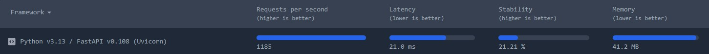
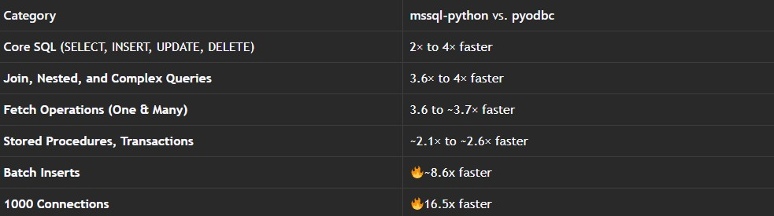
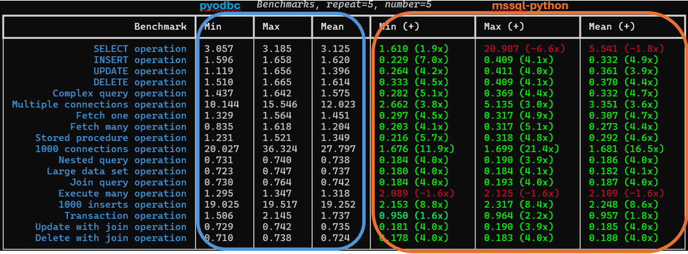
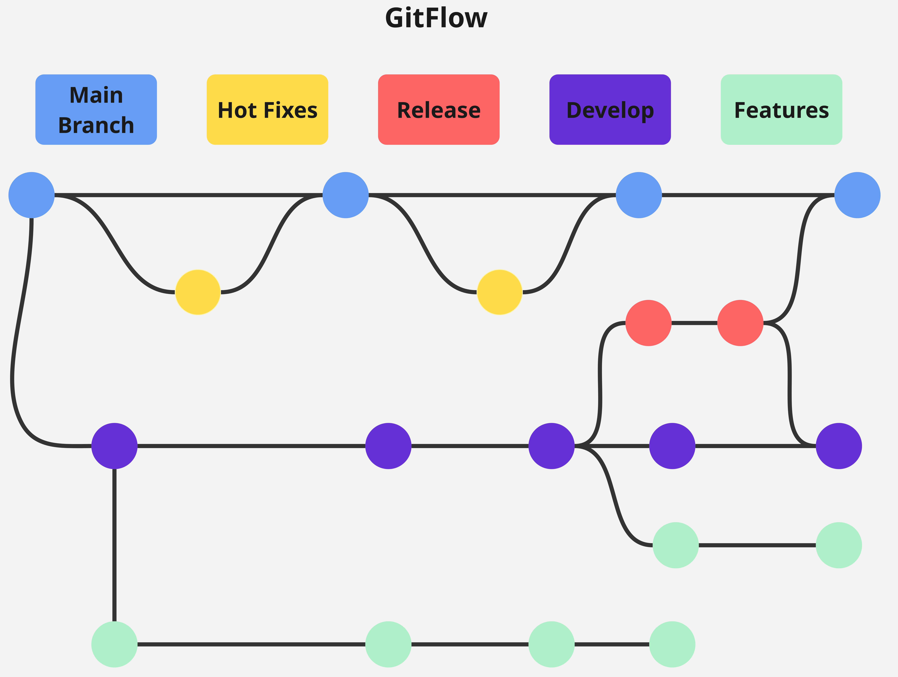
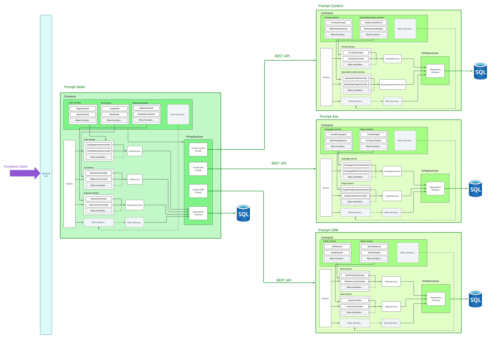

# Caso-2-PromptSales
### Instituto Tecnológico de Costa Rica
### Escuela de Ingeniería en Computación
### Students
- Alexander Brenes Garita - 2018191805
- Andrés Baldi Mora - 2024088934
- Lindsay Nahome Marín Sánchez - 2024163904
### Course
Software Design
### Delivery dates
🗓️ First delivery: October 26, 2025

🗓️ Second delivery: November 8, 2025

🗓️ Final delivery: November 23, 2025


### Project Structure:

```bash
Caso-2-PromptSales/
├── diagrams/
├── img/
├── kubernetConfig/
└── README.md
```

## 1. Introduction
This repository details the design of the application Prompt Sales

## 2. Scope
This project will be executed through three iterations.

## 3. Metrics for non-functional requirements

### 3.1 Performance
El software quie vamos a usar para crear el proyecto son:

#### Lenguaje de programacion
- Python

#### Gestor de base de datos
- SQL Server

#### Interfaz para conectar sistemas
- APIs Rest

#### Framework para crear APIs
- FastAPI (compatible con el lenguaje Python)

### Almacen de datos en memoria
- Redis

El objetivo del rendimiento para el proyecto son los siguientes:
- Tener un promedio de respuesta en el portal web debe ser de < 2.5 segundos por operacion.
- Las consultas tiene que entregar resultados en menos de 400 milisegundos mediante Redis.
- Los procesos de generacion automatica deben ejecutarse en menos de 7 segundos para solicitudes simples y menos de 20 segundos para ejecuciones complejas

Buscando Benchmarks que usen el software de nosotros y con objetivos de rendimiento se encuentran los siguientes

#### FastApi + Python 
[Benchmark FastApi + Python](https://sharkbench.dev/web/python-fastapi)

El hardware que ellos usan es el siguiente:

**OS:** Linux/Docker
**CPU:** Ryzen 7 7800X3D

Y sus resultados son los siguientes:



El cual nos dice que RPS (request per second) es de **1185** con latencia de **21.0 ms** y usando de memoria **41.2 MB**.

#### SQL Server + Python
[Benchmark SQL Server + Python](https://devblogs.microsoft.com/python/mssql-python-vs-pyodbc-benchmarking-sql-server-performance/?utm_source=chatgpt.com)

Que dicho Benchmark nos habla sobre el controlador para conectar aplicaciones Python con base de datos SQL.

El hardware que ellos usan es el siguiente:

**OS:** Windows 11 Pro
**CPU:** Intel Core i7 (12th Gen)
**RAM:** 32 GB
**Database:** Azure SQL Database - VCores 1
**Storage:** 32 GB

Y este es un resumen del rendimiento:



Y estos son los tiempos que usaron cuando ejecutaron alguna operacion:



Ahora con dicha informacion la extrapolamos con el software y performance de nuestro proyecto:

#### RQS (request per second)

- Total RPS = 1,667

- Cache hits = 0.5 × 1,667 = 833 RPS

- DB writes = 0.30 × 1,667 = 500 RPS

- DB reads = 0.20 × 1,667 = 334 RPS

- Total operaciones que tocan DB ≈ 834 RPS (500 + 334)

#### Pods que vamos a usar para FastAPI

Para el DB-Bound vamos a usar la siguien formula:

> pods_db = ⌈834(RPS)/300(procesos)⌉ = 3pods

#### Dimensiones de la base de datos (vCores)

- DB TPS requerido ≈ 834 TPS(transaction per second).
- Pensamos que es 100 TPS/vsCore esta seria la formula 

> vCores = ⌈834(RPS)/100(TPS)⌉ = 9vCores

**Nota:** Se usara Azure SQL Business Critical para tener una menos latencia

#### Redis

Para tener la latencia a menos de 400 ms se y sabemos que los cache hits son: 833RPS * 2 ≈ 1700 ops(operation per second)

**Nota:** Se usara Azure Cache for Redis con capacidad para ≥5k ops/s y latencia < 10 ms para garantizar los ≤ 400 ms

#### IA generation

Para la IA lo pensamos asi IA RPS ≈ 83.
Lo cual el promedio de ejecucion: (simple + complejo) ≈ 5.4 s → concurrencia requerida ≈ 83 × 5.4 ≈ 448 tareas concurrentes.

**Nota:** Se usara Azure OpenAI para asegurar tiempos <7s / <20s 

#### Almacenamiento

La formula sera la siguiente:

$$
GB_{por\_día} = \frac{PPM \times bytes/prompt}{1024^2} \times 60
$$

- PPM = prompts por minuto
- bytes/prompt = tamaño promedio de cada prompt
- 1024^2 = bytes a megabytes
- 60 = minutos a horas

**Nota:** Se usara Azure Blob Storage para guardar dicha informacion

### 3.2 Scalability
To transform PromptSales into a highly scalable system, we will use Azure Kubernetes Service (AKS). Additionally, Azure SQL Database will assure horizontal scaling capabilities in all the databases.

The Kubernetes network, managed by AKS, is responsible for dynamically scaling the stateless application pods and the Redis cache. 

The Redis cache is configured for automatic scaling using a Horizontal Pod Autoscaler (HPA) with a range of X to Y replicas. According to the established amount in the performance section.

Here is the HPA file that demonstrates scalability with the cache:
```yaml
apiVersion: autoscaling/v2
kind: HorizontalPodAutoscaler
metadata:
  name: redis-hpa
  namespace: redis-cache
spec:
  scaleTargetRef:				# This file targets the deployment of redis.
    apiVersion: apps/v1
    kind: Deployment
    name: redis-deployment
  minReplicas: 2
  maxReplicas: 10
  metrics:
    - type: Resource
      resource:
        name: cpu
        target:
          type: Utilization
          averageUtilization: 70		# The autoscale will take place when more than 70% of a pod's cpu is being used
    - type: Resource
      resource:
        name: memory
        target:
          type: Utilization
          averageUtilization: 75		# The autoscale will take place when more than 75% of a pod's memory is being used
```
It declares a minimum of X replicas and maximum of Y. The scale takes place when more than 70% of CPU is being consumed in one pod or 75% of memory is being used instead.

All scaling rules and pod configurations are defined and managed through declarative YAML files.

[Check kubernetes configuration folder]( https://github.com/CholiRat/Caso-2-PromptSales/tree/main/kubernetConfig)

For the databases, scalability is managed directly by Azure SQL Database. This plataform offering provides robust horizontal scaling through two primary mechanisms:

-	Elastic Pools: To efficiently manage performance and cost for multiple databases with variable usage patterns.
-	Sharding with Elastic Database Tools: To distribute data across multiple databases to handle high-volume transactions.

For more information check the oficial documentation: [Elastic scale - Azure SQL Database | Microsoft Learn](https://learn.microsoft.com/es-es/azure/azure-sql/database/elastic-scale-introduction?view=azuresql)

To meet the requirement of handling 100,000 transactions, the data will be partitioned across X sharded set of databases. This is according to the data retrieved from the perfomance benchmarks
-	Number of Shards: The system will be configured with X shards. 
-	Data Distribution: Information will be partitioned into X distinct parts using a hash function over the campaignIDs. In this way, distribution is balanced according to the amount of campaigns in the system.

To give a better understanding of the architecture, a diagram is provided:


### 3.3 Reliability

### 3.4 Availability

#### Failover and replication
To ensure system resilience, high availability is implemented across both the databases and application using a combination of Azure SQL databases and AKS.

For the data layer, high availability is achieved using the **Geo-Replication** feature of Azure SQL Database (PaaS). This service is configured for every database shard (PromptSales, PromptAds, PromptContent, PromptCRM) and provides two critical functions:
- Real-time Replication: A constant, synchronized replica of each primary database is maintained in a secondary geographic region (West Europe) which is constantly being synced with the primary region. This ensures data is duplicated in near real-time, protecting against High availability disaster recovery.
- Automatic Failover: In the event of an outage in the primary region (US), Azure automatically redirects all connections to the secondary database without manual intervention. This failover process takes less than 25 seconds, guaranteeing high availability. Once the primary region is restored, connections are moved back.


The connection endpoints for this configuration are managed within the cluster via a ConfigMap:
```yaml
apiVersion: v1
kind: ConfigMap
metadata:
  name: azure-config
  namespace: default
data:
  # Primary regions
  AZURE_PRIMARY_REGION: "US"
  PROMPTSALES_DB_PRIMARY: "promptsales-db-us.database.windows.net"
  PROMPTADS_DB_PRIMARY: "promptads-db-us.database.windows.net"
  PROMPTCONTENT_DB_PRIMARY: "promptcontent-db-us.database.windows.net"
  PROMPTCRM_DB_PRIMARY: "promptcrm-db-us.database.windows.net"
  
  # Secondary regions
  AZURE_SECONDARY_REGION: "West Europe" 
  PROMPTSALES_DB_SECONDARY: "promptsales-db-westeurope.database.windows.net"
  PROMPTADS_DB_SECONDARY: "promptads-db-westeurope.database.windows.net"
  PROMPTCONTENT_DB_SECONDARY: "promptcontent-db-westeurope.database.windows.net"
  PROMPTCRM_DB_SECONDARY: "promptcrm-db-westeurope.database.windows.net"
```
For more information about Geo-replication, visit: [Active-Geo-replication](https://learn.microsoft.com/en-us/azure/azure-sql/database/active-geo-replication-configure-portal?view=azuresql&tabs=portal)

On another note, AKS will assure replication and failover using K8s a LoadBalancer and HPA.

Kubernetes automatically maintains the desired number of application pod replicas as defined in the Horizontal Pod Autoscaler (HPA). If a pod fails, Kubernetes immediately restarts it or schedules a new one.

This is a section of the HPA file for Redis
```yaml
  scaleTargetRef:				# This file targets the deployment of redis.
    apiVersion: apps/v1
    kind: Deployment
    name: redis-deployment
  minReplicas: 2	 
  maxReplicas: 10
```
With the LoadBalancer type service, the application efficiently distributes incoming network requests across all available, healthy application pods.
```yaml
# The service file establishes the point of connection for redis in our kubernet

apiVersion: v1
kind: Service
metadata:
  name: redis-service
  namespace: redis-cache
spec:
  type: LoadBalancer		# Regulates the traffic between the multiple pods replicas
  selector:
    app: redis-cache
  ports:
    - port: 6379 		# The default port on redis
      targetPort: 6379
```
#### Service Level Agreement (SLA)
Azure guarantees 99.95% availability for their SQL Database services, which forms the foundation of our high-availability architecture.
Assuming a 31 day month, this means:
-	Total minutes in month: 44,640 min
-	Available minutes per Azure SLA: 44,617.68 min
-	Azure SLA downtime allowance: 22.32 min
#### Failover considerations
According to Azure documentation, databases are down for up to 25 seconds while the regions are being switched. For this calculation, we assume the worst scenario, 25 seconds of downtime.
- Assumed fail frequency: 2 times per day through all Prompt Sales services
- Daily downtime: 50 seconds (2 × 25 seconds)
- Monthly downtime (31 days): 1,550 seconds (25.833 minutes)
- Azure infrastructure: 22.32 min
- Planned failovers: 25.833 min
- Total downtime: 48.153 min
- Available total minutes: 44,591.847 min

Monthly availability: 99.892%

The system achieves 99.89% availability, comfortably meeting the standards for this requirement.

### 3.5 Security

### 3.6 Maintainability
To ensure the maintainability of the system in both the short and long term, standardized processes will be implemented for both development and post-production support.

#### 3.6.1 During Development

Source code and task management will adhere to the following methodologies:

- Task Management: All work will be managed through a ticketing system in Trello. Each team member is responsible for keeping their tickets updated on a weekly basis.
- Version Control: A Gitflow-based workflow will be used, with the following branches:

    - Main Branch / Master
      - Contains stable production code of all project, including versions (release tag, eg: v1.2.3), production configuration (environment variables or config files) and documentation for releases that should be update or include somewhere else in the branch, like release notes or a CHANGELOG.md for example.
    
    - HotFixes Branch
      - Branches for critical fixes in production, based on main. This branch is used for fixing issues on the master branch. Is employed for quickly fix critical issues and for urgent bugs that can not wait until the next release cycle. For example, Security vulnerabilities.

    - Release Branch
      - Is used to stabilize the codebase before deploying to production. Allows to do things like this ones:
        - Freeze development for the current sprint/release cycle.
        - Perform final QA, bug fixing, and versioning.
        - Continue development of new features in parallel (in develop).
    
    - Develop Branch
      - Is the central integration branch for all new code that’s being prepared for the next release. Is where all the developers work on and all the features are merged once they are done. Is where the lastest stable development version of the software lives in.
    
    - Feature Branch
      - Is used to develop a single feature or improvement in isolation. Isolated from develop until the feature is complete. Focused on a specific goal or story. Temporary: deleted after being merged into develop.

      GitFlow Image

      

- Other things that are going to be employ for Maintainability during development are the following:


- Pull Requests (PRs): All code must be integrated into develop or main exclusively through Pull Requests. Each PR must be reviewed and approved by at least one team member before merging.

- Release Process: Production releases will be carried out on a scheduled basis every two weeks (sprint cycle), merging the develop branch into main after successful validation in the staging environment.

- Hotfix Process: Critical fixes (hotfixes) will be developed in their own branch (hotfix/) based on main. Once approved, they will be merged into both main (for immediate deployment) and develop (to prevent regressions).

#### 3.6.2 Post-Development Support

A tiered support model (L1, L2, L3) is established to manage incidents and inquiries:

- Level 1 (L1 – Basic Support):

  - Channel: User manuals, tutorial videos, and an RAG (Retrieval-Augmented Generation) system via WhatsApp for common questions.

  - Objective: Self-service and resolution of frequent doubts.

- Level 2 (L2 – Technical Support):

  - Channel: Email (support@promptsales.com).

  - Response Time (Service Level Agreement): Acknowledgment between 8 and 12 business hours.

  - Resolution Time (Service Level Agreement): Incident resolution between 4 and 7 business days.

- Level 3 (L3 – Specialized Support):

  - Channel: Internal issue tracking system (e.g., Trello or GitHub Issues), escalated from L2.

  - Objective: Resolution of complex bugs, infrastructure failures, or integration problems requiring development team intervention.

### 3.7 Interoperability
To ensure that the PromptSales modules (Ads, Content, and CRM) operate in an integrated manner and can connect with external services, we have chosen REST APIs as our primary communication method.

This approach will be used for all communication between services built with Flask and FastAPI, as well as for managing automation processes.
When designing our APIs, we will follow RESTful principles, including the use of Redis caching to optimize interactions and improve platform performance, in line with performance requirements.

Finally, for specialized communication among various AI services (which have different requirements), the use of MCP (Model Context Protocol) servers will be reserved.
### 3.8 Compliance

The system will be designed in accordance with international standards for security and data protection:

#### Payment Management

All credit card, transfer, or monetary transaction data will not be stored in our systems. These operations will be fully delegated to third-party payment gateways that comply with PCI DSS certification.

#### Application Security

- Web applications (Vercel) will follow the OWASP Top 10 2.0 recommendations.

- Backend services (REST APIs in Flask/FastAPI) will be developed mitigating OWASP Top 10 3.x vulnerabilities, with particular emphasis on access control (OAuth 2.0) and data injection.

#### Data Protection (GDPR/CCPA)

- Encryption of sensitive data at rest (AES-256) and in transit (TLS 1.3).
- Implementation of the least privilege principle (minimum necessary access).
- Mechanisms for user consent management and the right to be forgotten.

### 3.9 Extensibility
Design choices have been made to guarantee the extensibility of the system across its lifetime. In this section, design patterns and other tools are discussed to demonstrate their ability to expand the application.
#### 3.9.1 REST
The REST architecture employed across the entire system enables integration with new sub-businesses and third-party services. 

When a new business is incorporated into PromptSales, the frontend layer remains unaffected, allowing to add new services. Also, the stateless nature of REST architecture further enhances independence between the different architectural layers, ensuring clean separation and modularity.
#### 3.9.2 Kubernetes
Kubernetes provides foundation for system extensibility by allowing integration of new services and capabilities without disrupting existing operations. Its architecture is specifically designed to support continuous growth and modular expansion. AKS extends these capabilities with cloud-specific features that further simplify extensibility.
#### 3.9.3 MCP 
MCP servers centralize the connection point for various AI models. This architecture allows new sub-businesses to immediately leverage existing AI tools available to develop. Furthermore, the system is extensible at the MCP layer; new tools, context sources, or AI models can be added to the MCP server, thereby expanding its capabilities without requiring modifications across every other system component.
#### 3.9.4 Domain Driven Design
The Domain-Driven Design architecture for the backend is crucial for extensibility. It ensures that new functionalities are added as entirely new domains, rather than by modifying existing ones. This prevents regressions and maintains system stability. Consequently, development teams can work independently on different domains, accelerating feature development and enabling parallel workstreams without creating interdependencies or conflicts.

## 4. Domain Driven Design

#### 4.1 Prompt Content Domains
Prompt content focuses on requests to AI services to produce ad material such as text, images and videos. As such, the following list illustrates the domains that compose this business.
- User domain
- AI domain
- Target domain
- Prompt domain
- Generated content domain
- Channel domain
#### 4.2 Prompt Ads Domains
Prompt ads manages the creation of new marketing campaigns.
- User domain
- AI domain
- Organization domain
- Campaign domain
- Ad domain
- Target domain
- Reaction domain
- Channel domain
- Client domain
- Payment domain
#### 4.3 Prompt CRM Domains
Prompt CRM has the goal to follow activity of interested customers.
- User domain
- AI domain
- Target domain
- Channel domain
- Client domain
- Sales domain
- Marketing services domain
- Payment domain
#### 4.4 Prompt Sales Domains
- User domain
- AI domain
- Organization domain
- Campaign domain
- Ad domain
- Target domain
- Channel domain
- Client domain
- Payment domain
- Services domain

#### Diagram
The following is an image of the Domain Driven Design backend. The frontend communicates through an API and has access to all sub-businesses. 

The main application PromptSales gains access to Prompt Content, Prompt Ads and Prompt CRM through the infrastructure layer with a facade. From this point, it uses an ETL approach to obtain data from sub-businesses and syncronize information.


Check the pdf file to gain a better look of this diagram: [DomainDrivenDesign-Diagram](diagrams/DomainDrivenDesign.pdf)
